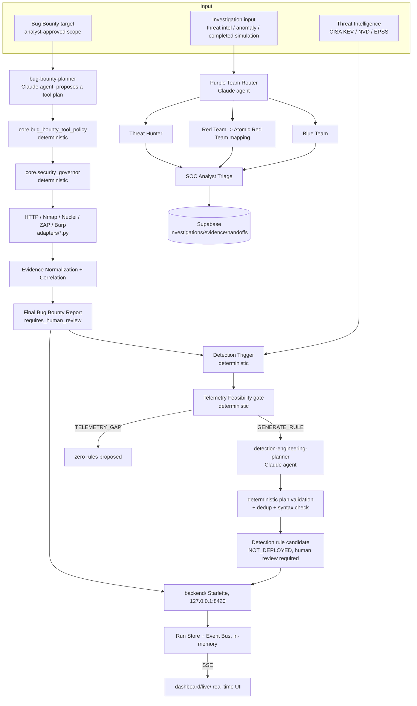

# ThreatTrace Architecture

This document describes the current architecture of ThreatTrace: the original Purple Team investigation loop, and the Bug Bounty / Threat Intelligence / Detection Engineering / live platform layer built on top of it in Blocks 15A–15L-16.

## Terminology: four different things that are easy to conflate

ThreatTrace deliberately keeps four concepts separate. Nothing in this repository is "an autonomous agent" merely because it has a name.

| Term | What it actually is | Examples |
|---|---|---|
| **Functional role** | A closed-vocabulary label used by deterministic policy code (`core.security_governor.ROLES`, `core.pipeline_orchestrator.ROLES`) to describe *who* an action is attributed to. Never an LLM, never executable. | `bug_bounty`, `blue_team`, `red_team`, `threat_intelligence`, `human_analyst` |
| **Claude custom agent** | A real, separately-invoked LLM agent defined under `.claude/agents/*.md`. Proposes, interprets, explains — never authorizes, never deploys, never executes a tool directly. | `purple-team`, `atomic-mapper`, `bug-bounty`, `security-governor`, `bug-bounty-planner`, `detection-engineering-planner` — **exactly six**, never described as more |
| **Policy identity** | A deterministic, code-registered entry in `core.agent_identity_policy`'s fixed registry — a role/tool-allowlist/operation-ceiling record, evaluated by pure Python, never an LLM. | `observer_agent`, `analyst_agent`, `coordinator_agent`, `reviewer_agent`, `bug_bounty_agent` |
| **Deterministic core service** | A pure or adapter-boundary Python module under `core/`/`adapters/`/`backend/`/`runtime/` that validates, enforces, or records — never reasons in natural language. | `core.security_governor`, `core.bug_bounty_tool_policy`, `core.detection_planner`, `backend.orchestrator` |

`core.ai_asset_registry` is the authoritative, code-enforced inventory of every Claude subagent, command, skill, gateway tool, policy identity, and MCP server in this repository — run `python -m core.ai_asset_registry_cli` (or see `tests/test_ai_asset_registry.py`) rather than trusting a prose count anywhere, including in this document.

## System Diagram



## Deterministic Core Services (by area)

- **Bug Bounty**: `core.bug_bounty_scope`, `core.bug_bounty_tool_policy`, `core.bug_bounty_assessment`, `core.bug_bounty_tool_execution`, `core.bug_bounty_evidence_normalization`, `core.bug_bounty_finding_correlation`, `core.bug_bounty_final_report`, `core.bug_bounty_findings`.
- **Threat Intelligence**: `core.threat_intelligence`, `core.threat_intelligence_report`, plus `adapters.threat_intel_{cisa_kev,nvd,epss,configured_sources}`.
- **Detection Engineering**: `core.detection_trigger`, `core.detection_telemetry`, `core.security_enrichment`, `core.detection_planner`, `core.detection_rule`, `core.detection_rule_normalization`, `core.detection_rule_deduplication`, `core.detection_rule_validation`, `core.detection_engineering_report`.
- **Governance/Policy**: `core.security_governor`, `core.agent_gateway`, `core.agent_identity_policy`, `core.mutation_freeze`, `core.decision_binding`, `core.ai_asset_registry`.
- **Context/Handoff/Memory**: `core.context_prioritization`, `core.security_handoff`, `core.security_experience_memory`, `core.pipeline_orchestrator` (a pure field-mapping translator between these).
- **Live platform**: `backend.models`, `backend.event_bus`, `backend.run_store`, `backend.orchestrator`, `backend.app`.
- **Runtime/packaging**: `runtime.tool_runtime`, `runtime.bootstrap`.
- **Original investigation loop**: `mcp/hayabusa_server.py` (offline EVTX analysis), `supabase/schema.sql` (six-table investigation schema), `.claude/agents/purple-team.md` / `atomic-mapper.md`, `.claude/commands/*` (investigation, case, query, approval commands).
- **Research/reporting**: `core.research_evaluation`, `core.benchmark_evaluation`, `core.juice_shop_ground_truth`, `core.presentation_dashboard`, `core.tamper_evident_audit`, `core.evaluation_dashboard`.

## The Six Claude Custom Agents

| Agent | Role | Never does |
|---|---|---|
| `purple-team` | Coordinates the investigation loop; routes to Threat Hunter/Red Team/Blue Team | Execute a tool, write to Supabase directly |
| `atomic-mapper` | Matches evidence-supported ATT&CK techniques to a locally-available Atomic Red Team catalog | Execute an Atomic test |
| `bug-bounty` | Application-security assessment orchestration and evidence-grounded explanation | Run outside a caller-supplied target/scope |
| `bug-bounty-planner` | Proposes a structured Bug Bounty test plan from analyst permissions + untrusted target observations | Execute a tool itself |
| `security-governor` | Interprets a Governor evaluation result honestly for a human reader | Change the Governor's own deterministic decision |
| `detection-engineering-planner` | Proposes a detection rule draft from a Detection Trigger + telemetry feasibility result | Deploy, approve, or claim validation it did not perform |

## Action and Approval Boundary

- Read-only investigation, planning, and readiness-detection actions may proceed without changing any system.
- Bug Bounty tool execution requires: analyst-supplied scope/permissions → `core.bug_bounty_tool_policy` permit → `core.security_governor` allow → the fixed, hardcoded adapter registry in `core.bug_bounty_tool_execution` (never a caller-supplied binary name).
- Detection rules are never modified or deployed automatically, under any circumstance — `core.detection_rule.build_detection_rule` has no parameter capable of setting `deployment_state` to anything but `NOT_DEPLOYED`.
- Supabase writes (opening a case, adding evidence, updating status) require explicit human confirmation.
- Red Team or Atomic test execution requires explicit human approval outside ThreatTrace's automated flow.
- Approval and execution remain distinct, separately-confirmed steps everywhere in the system.
- The `runtime/` Tool Runtime Manager only *detects* — it never installs software or elevates privileges; a missing Nmap/Npcap on Windows is reported `requires_admin_install`, never silently worked around.

## Security Governor (Block 15C.5)

`core.security_governor.evaluate_security_governor_event` evaluates one caller-supplied, structured observable event against sixteen fixed fields: `actor_role`, `action_class`, `current_stage`, `required_role`, `gateway_decision`, `identity_decision`, `mutation_freeze_active`, `approval_state`, `decision_binding_state`, `scope_state`, `source_truth_state`, `remote_content_state`, `audit_state`, `prior_policy_denials`, `execution_requested`. It returns `allow`/`warn`/`require_review`/`block`/`freeze` plus fixed-order reason codes. It performs no I/O, calls no LLM, and `execution_performed` is always `False` — a Governor decision is an **evaluation outcome**, never itself an enforcement mechanism, an authentication proof, or a claim about intent. See [docs/block15c5-security-governor.md](block15c5-security-governor.md).

## Live Platform Backend (Block 15J-K)

`backend/app.py` is a Starlette application bound to `127.0.0.1:8420` only. Route handlers are thin — all logic lives in `backend.orchestrator`, which sequences the same deterministic cores above and publishes sanitized, bounded events to `backend.event_bus` (in-memory, FIFO-evicted, never persistent). The backend itself never calls an LLM: the Bug Bounty planning stage uses one fixed default plan, and the Detection planning stage requires the caller to supply an already-produced LLM proposal. See [docs/block15jk-live-platform-dashboard.md](block15jk-live-platform-dashboard.md).

## Tool Runtime Manager (Block 15L-16)

`runtime.tool_runtime.evaluate_tool_readiness` detects, via an injectable I/O boundary (mirroring `adapters.bug_bounty_http`'s own injected-transport pattern), whether each supported tool is actually usable — never a bare true/false, but one of nine explicit states (`ready`/`missing`/`not_configured`/`requires_admin_install`/`container_available`/`runtime_unavailable`/`version_incompatible`/`unsupported`/`not_implemented`). `runtime.bootstrap` provides `check`/`start-demo`/`stop-demo` CLI subcommands; `start-demo` only ever starts the two fixed, named demo containers (`threattrace-juice-shop`, `threattrace-zap`), always bound to `127.0.0.1`, and never runs an install/update command itself.

## Original Investigation-Loop Architecture (Blocks 1–14)

- An **input source** (threat intelligence, an anomaly, or completed simulation evidence) enters through the **Purple Team router**.
- The router hands the investigation to **Threat Hunter**, **Red Team**, or **Blue Team** depending on entry point.
- Red Team and Blue Team draw on the **Hayabusa and Atomic catalog** layer — both read/planning-only, never executing anything themselves.
- Findings flow into **SOC Analyst triage**, reasoning over accumulated evidence against competing hypotheses.
- All investigation state is persisted in **Supabase**: `investigations`, `evidence`, `attack_mappings`, `handoffs`, `detection_results`, `retests`.
- Confirmed gaps feed detection engineering (see above); improvements are proven out through validation/retest, closing the loop back to the router.

Investigation `status`/`confidence` changes flow through a validated, atomic, approval-gated pipeline (`/request-case-update` → `/review-approval` → `/apply-case-update`), with `core.approval_bridge` and `core.approval_mcp_adapter` as the only two-phase (prepare → execute → normalize → verify) path into Supabase mutation. See [docs/block6-risk-aware-approvals.md](block6-risk-aware-approvals.md) for the full risk model.

## Approval-Gated Case Update Architecture (Block 5)

Investigation `status`/`confidence` changes flow through a validated, atomic, approval-gated pipeline:

```
Analyst
→ /request-case-update
→ approval request validator
→ approval bridge prepare
→ MCP adapter prepare
→ pending approvals insert
→ /review-approval
→ transition validator
→ conditional approvals update
→ /apply-case-update
→ consume transition validator
→ approval bridge prepare
→ MCP adapter prepare
→ atomic Supabase RPC
→ consumed approval + updated investigation
```

### Two-Phase Tool Architecture

Every database lookup and mutation in this pipeline follows the same four-step pattern:

```
Prepare
→ execute through mcp__supabase__execute_sql
→ normalize
→ verify
```

- Command Markdown never generates arbitrary SQL.
- The approval bridge (`core.approval_bridge`) creates the canonical persistence descriptor for each operation — an insert, a select, a conditional update, or an RPC call — by re-running the same pre-executor validation the real persistence function itself uses.
- The MCP adapter (`core.approval_mcp_adapter`) converts only an already-verified, allowlisted descriptor into one fixed SQL template. It never accepts arbitrary caller-supplied SQL, table names, or function names.
- The raw response from `mcp__supabase__execute_sql` is normalized (its untrusted-data block is parsed and its PostgreSQL timestamps canonicalized) before it is ever handed to verification — command Markdown never parses the raw response directly.
- Zero rows, multiple rows, a malformed row, a persistence conflict, and a transport error all fail closed. None of them is ever treated as success.
- The approval record loaded at the start of `/apply-case-update` is used for display and preparation only — it is **not final authorization**. The atomic RPC, `consume_approval_and_update_investigation_state`, is the final authority: it independently re-checks the approval's status, expiry, and stored bindings against the live row inside its own transaction.
- The stored `action_payload` on the approval record is the exclusive source of the applied `status`/`confidence` — `/apply-case-update` never accepts either value as direct input, and it never updates `public.investigations` through any other path.
- The atomic RPC returns exactly nineteen fields: the sixteen approval-record fields, plus `investigation_status`, `investigation_confidence`, and `investigation_updated_at`.
- `/update-case` is not part of this mutation architecture. It is a deprecated, static compatibility notice that performs no database operation of any kind.

## Data and Filesystem Boundaries

- Raw EVTX files remain under `evidence/evtx/`; generated Hayabusa results remain under `output/hayabusa/`.
- `backend/` and `runtime/` perform **no filesystem writes** at all — every run/event/readiness result is either in-memory (`backend`) or a real-time detection (`runtime`).
- Local MCP configuration, credentials, `.env`, machine-local settings, tool binaries, and third-party repositories are excluded from Git — see `.gitignore`.

## Current Security Limitations

- The validation hook (`.claude/hooks/validate-threattrace.ps1`) is `PostToolUse` and therefore advisory, not a preventive `PreToolUse` gateway.
- Supabase Row Level Security is enabled in the schema, but application access policies are not yet defined.
- `backend/` implements no authentication of any kind — it is a local development/research interface only.
- Decision Binding is not implemented as a real cryptographic mechanism anywhere in this repository; every Governor event's `decision_binding_state` is caller-supplied observable state, and `backend.orchestrator`'s own Governor events honestly use `execution_requested: False` rather than falsely claiming a Decision Binding it doesn't have (see [docs/block15jk-live-platform-dashboard.md](block15jk-live-platform-dashboard.md#10-the-governor-honesty-decision)).
- Evidence/action hashing, immutable audit history, action budgets, and kill-switch controls remain planned, not implemented.
- Authenticated testing and controlled validation remain declared, not implemented.

## Planned / Future Work (Block 17+)

The following are future work names only — none of them are implemented yet:

- Final validation pass (17A)
- Presentation/demo materials (17B)
- Structured feedback intake (17C)
- Refinement based on feedback (17D)
- Research paper (17E, last)
