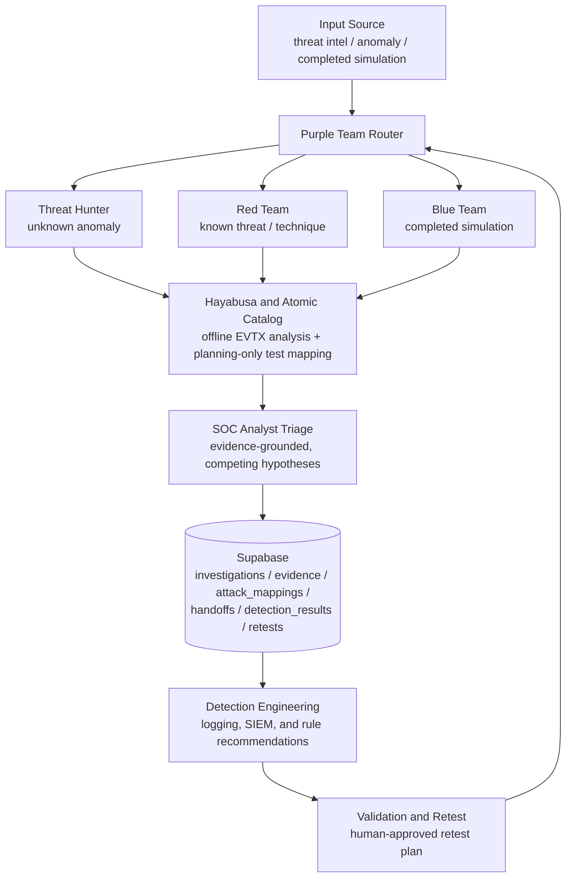

# ThreatTrace Architecture

This document describes the high-level flow of data and control through ThreatTrace, from an initial input source to a validated (or retested) detection outcome.

## Flow Overview

- An **input source** (threat intelligence, an anomaly, or completed simulation evidence) enters through the **Purple Team router**, which determines the investigation's entry point and current stage.
- The router hands the investigation to the appropriate role — **Threat Hunter**, **Red Team**, or **Blue Team** — depending on whether the input is an unknown anomaly, a known threat/technique, or already-collected test evidence.
- Red Team and Blue Team workflows draw on the **Hayabusa and Atomic catalog** layer: Hayabusa for offline EVTX telemetry analysis, and the Atomic Red Team catalog for verified, planning-only technique-to-test mapping.
- Findings flow into **SOC Analyst triage**, which reasons over the accumulated evidence against competing hypotheses before anything is escalated or closed.
- All investigation state — cases, evidence, ATT&CK mappings, handoffs, detection results, and retests — is persisted in **Supabase**.
- Confirmed gaps feed **detection engineering**, which proposes (but never auto-deploys) logging, SIEM, and detection-rule improvements.
- Improvements are proven out through **validation and retest**, which closes the loop back to the Purple Team router for the next cycle.

## Diagram

## Notes

- Every arrow into Hayabusa or the Atomic Red Team catalog is **read/analysis only** — neither component executes anything on its own.
- Supabase is the single source of truth for investigation state; all reads and writes are explicit and, for writes, confirmed by a human.
- The loop back from **Validation and Retest** to the **Purple Team Router** reflects that a retest is itself a new pass through the same investigation lifecycle, not a separate system.

## Current Implemented Architecture

The components below exist in this repository today and back the flow described above:

- `.claude/agents/purple-team.md` — the Purple Team workflow coordinator.
- `.claude/agents/atomic-mapper.md` — Atomic Red Team planning and technique-to-test mapping.
- `.claude/commands/` — investigation, Red Team, Blue Team, Threat Hunt, evidence, case, query, and orchestration commands.
- `mcp/hayabusa_server.py` — a project-scoped Hayabusa MCP server.
- `supabase/schema.sql` — a six-table investigation schema.
- `evidence/evtx/` — the local raw EVTX evidence location.
- `output/hayabusa/` — the generated Hayabusa result location.
- `.claude/hooks/validate-threattrace.ps1` — an advisory, post-write validation hook.

## Action and Approval Boundary

- Read-only investigation and planning actions may inspect evidence and propose actions.
- Red Team simulations must never execute automatically.
- Detection rules must never be modified or deployed automatically.
- Database writes and other system-changing actions require explicit human confirmation.
- Hayabusa follows a plan-versus-execute pattern: a validation/planning tool checks a request without running anything, and a separate tool is required to actually execute it.
- `run_evtx_analysis` is the only current Hayabusa execution tool.
- It requires an authorization phrase, validated project-relative paths, allowlisted analysis types, and a new (non-overwriting) output filename.
- The current authorization phrase is an initial safeguard, not the final approval system.
- A verified approval ID, evidence hash, action hash, expiry, reviewer validation, and audit trail are planned but not implemented yet.

## Data and Filesystem Boundaries

- Raw EVTX files remain under `evidence/evtx/`.
- Generated Hayabusa results remain under `output/hayabusa/`.
- Input and output paths must resolve inside the project.
- Existing output files cannot be overwritten by the Hayabusa MCP tool.
- Raw evidence and generated output are excluded from Git, except `.gitkeep` placeholders.
- Local MCP configuration, credentials, machine-local settings, binaries, and third-party repositories are excluded from Git.

## Current Security Limitations

- The validation hook is `PostToolUse` and therefore detects problems after a file write rather than preventing the original write.
- No project-level `PreToolUse` gateway currently exists.
- The local settings may contain permissive tool allowances and are not a portable project policy.
- Supabase Row Level Security is enabled, but no application access policies are currently defined.
- Evidence hashing, immutable audit history, action hashing, approval expiry, reviewer identity, action budgets, and kill-switch controls are not yet implemented.
- Detection Engineering and dedicated validation/retest orchestration are not yet complete workflow commands.

## Planned Improvement Blocks

The following are future work names only — none of them are implemented yet:

- Evidence-grounded investigation
- Decision-change explainability
- Human approval workflow
- Exact-action verification
- Risk-based approval
- Shadow execution
- AI Agent Gateway
- Agent identity and least privilege
- AI asset inventory
- AI Security Evaluation Lab
- Analyst feedback
- Tamper-evident audit
- Risk and evaluation dashboard
- Open-source deployment
- Final demonstration and presentation
