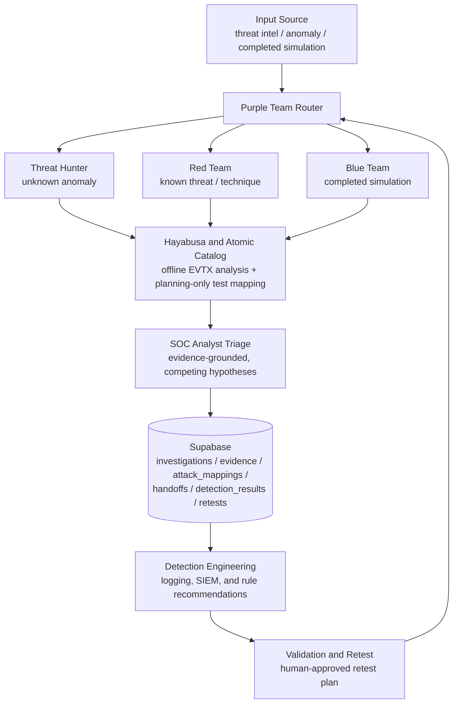

# ThreatTrace Architecture

This document describes the high-level flow of data and control through ThreatTrace, from an initial input source to a validated (or retested) detection outcome.

## Flow Overview

- An **input source** (threat intelligence, an anomaly, or completed simulation evidence) enters through the **Purple Team router**, which determines the investigation's entry point and current stage.
- The router hands the investigation to the appropriate role — **Threat Hunter**, **Red Team**, or **Blue Team** — depending on whether the input is an unknown anomaly, a known threat/technique, or already-collected test evidence.
- Red Team and Blue Team workflows draw on the **Hayabusa and Atomic catalog** layer: Hayabusa for offline EVTX telemetry analysis, and the Atomic Red Team catalog for verified, planning-only technique-to-test mapping.
- Findings flow into **SOC Analyst triage**, which reasons over the accumulated evidence against competing hypotheses before anything is escalated or closed.
- All investigation state — cases, evidence, ATT&CK mappings, handoffs, detection results, and retests — is persisted in **Supabase**.
- Confirmed gaps feed **detection engineering**, which proposes (but never auto-deploys) logging, SIEM, and detection-rule improvements.
- Improvements are proven out through **validation and retest**, which closes the loop back to the Purple Team router for the next cycle.

## Diagram

## Notes

- Every arrow into Hayabusa or the Atomic Red Team catalog is **read/analysis only** — neither component executes anything on its own.
- Supabase is the single source of truth for investigation state; all reads and writes are explicit and, for writes, confirmed by a human.
- The loop back from **Validation and Retest** to the **Purple Team Router** reflects that a retest is itself a new pass through the same investigation lifecycle, not a separate system.
